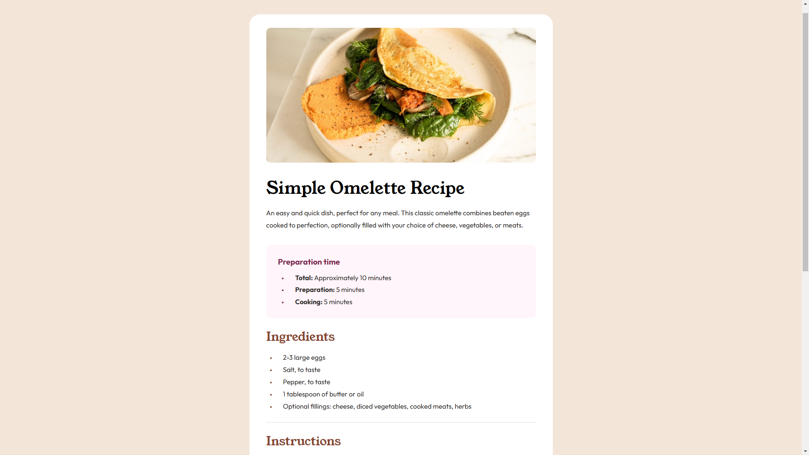
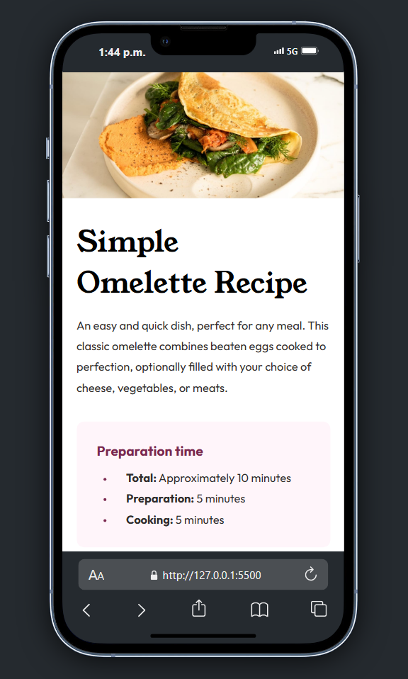
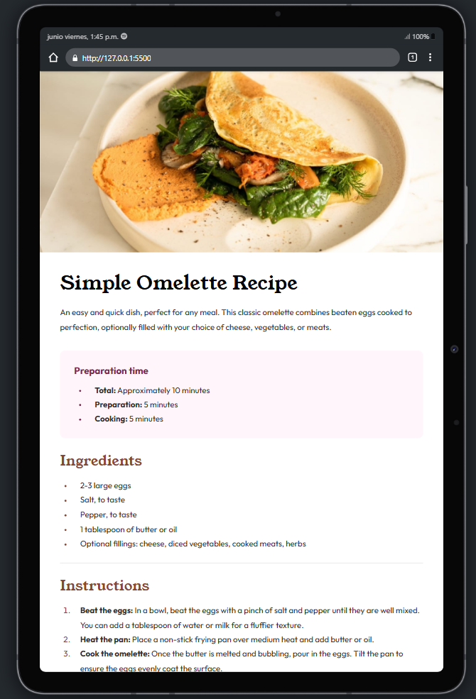

# Recipe page - Frontend Mentor

## Table of contents

- [Recipe page - Frontend Mentor](#recipe-page---frontend-mentor)
  - [Table of contents](#table-of-contents)
  - [Overview](#overview)
    - [Screenshot](#screenshot)
  - [My process](#my-process)
    - [Built with](#built-with)
  - [Author](#author)

## Overview

Hi, there! 👋🏽

Very thank you for checking out my solution to the [Recipe page](https://www.frontendmentor.io/challenges/recipe-page-KiTsR8QQKm) from Frontend Mentor. 😀

Another challenge achieved! 😁

I hope you like and feel free to look around and explore! 😊

### Screenshot

**Desktop**

 

**In mobile**

 

**In tablet**

 

## My process

### Built with

- Semantic HTML5 markup
- CSS custom properties
- Responsive design

## Author

- GitHub - [P0wertDev](https://github.com/P0wertDev)
- Frontend Mentor - [@P0wertDev](https://www.frontendmentor.io/profile/P0wertDev)
- Twitter - [@P0wertDev](https://x.com/P0wertDev)